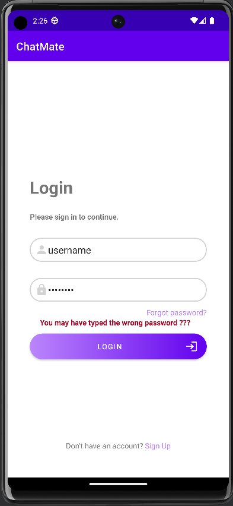
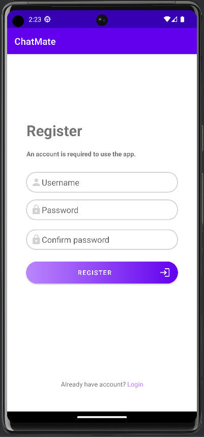
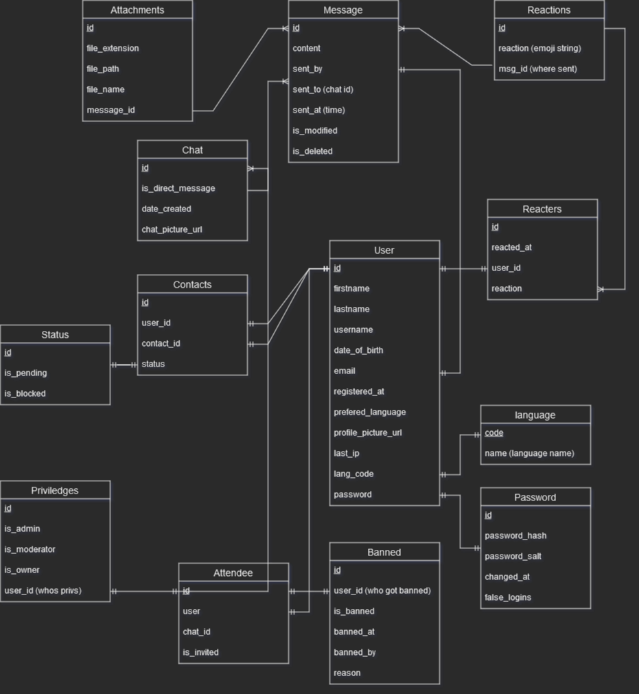

# ChatMate

Android Chat App written in Kotlin and Python

## Current status

### Frontend

Login and Register screens are implemented.

### Backend

User creation in progress...

---

## Docs

### Database

Plan of database

### API Endpoints

- ``/users/me``
- ``/users/token``
- ``/users/login``
- ``/users/register``

